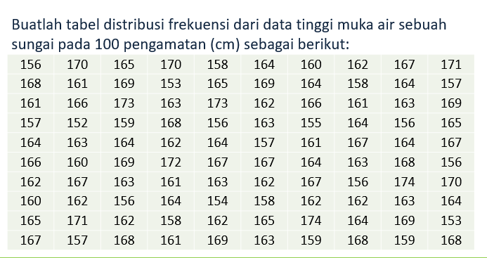
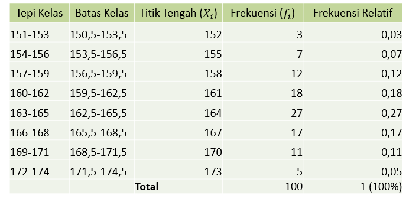

# 🚀 Distribusi Frekuensi - (_Pertemuan 1 - 2_)

### List Bab

- [Pengertian Statistik 🔥](./README-week-2.md)
- [Distribusi Frekuensi](#distribusi-frekuensi)

## Distribusi Frekuensi

#### 1. Rumus

> - Range -> `r = max - min`
> - Perkiraan banyak kelas -> `k = 1+3,3log⁡(𝑛)`.
>   𝑛 adalah jumlah data
> - Lebar kelas `c = r / k`
> - Tepi bawah kelas pertama `a_1 = min - ((k * c) - r) / 2` ,

    			     lalu 𝑎_2 = 𝑎_1 + 𝑐 ,

dst...

> - Batas bawah -> `𝑎_1 - 0,5`
> - Batas atas -> `𝑎_1 + 0,5`

## Example

### Tabel-frekuensi

Buatlah tabel distribusi frekuensi dari data tinggi muka air sebuah sungai pada 100 pengamatan (cm) sebagai berikut:

#### 1. Range

    r = max - min
    r = 174 - 152 = 22

#### 2. Perkiraan banyak kelas

    k = 1+3,3log⁡(𝑛)
    k = 1+3,3log⁡(100) = 7,6 (dibulatkan ke atas menjadi 8)

#### 3. Lebar kelas

    c = r / k
    c = 22 / 7,6 = 2,89 (dibulatkan ke atas menjadi 3)

#### 4. Tepi bawah kelas pertama

    a_1 = min - ((k * c) - r) / 2
    a_1 = 152 - ((8 * 3) - 22) / 2 = 151
    a_2 = a_1 + c = 151 + c - 1 = 153

> dan seterusnya

#### 🔥 _Tips and Trick_ :

> Untuk menyelesaikan perhitungan tersebut, kita bisa mengikuti aturan prioritas operasi (operator precedence) yaitu:
>
> - Hitung operasi dalam kurung terlebih dahulu, yaitu `(8 * 3) - 22 = 24 - 22 = 2`.
> - Hitung pembagian, yaitu `2 / 2 = 1`.
> - Hitung pengurangan, yaitu `152 - 1 = 151`.
> - Sehingga, hasil dari perhitungan tersebut adalah `151`.

#### 5. Results

| Tepi - Kelas |  Batas Bawah  | Titik Tengah `(Xi)` | Frekuensi `(fi)` | Frekuensi Relatif `(fi/n)` |
| :----------: | :-----------: | :-----------------: | :--------------: | :------------------------: |
|  151 - 153   | 150,5 - 153,5 |         152         |        3         |            0,03            |
|  154 - 156   | 153,5 - 156,5 |         155         |        5         |            0,05            |
|  157 - 159   | 156,5 - 159,5 |         158         |        8         |            0,08            |
|  160 - 162   | 159,5 - 162,5 |         161         |        9         |            0,09            |
|  163 - 165   | 162,5 - 165,5 |         164         |        12        |            0,12            |
|  166 - 168   | 165,5 - 168,5 |         167         |        15        |            0,15            |
|  169 - 171   | 168,5 - 171,5 |         170         |        17        |            0,17            |
|  172 - 174   | 171,5 - 174,5 |         173         |        17        |            0,17            |

> Source : Pak Dosen (Fandy)
